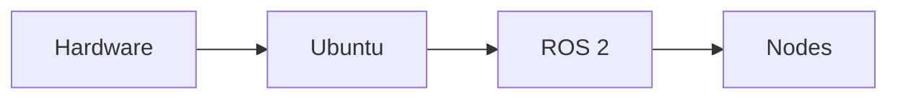

# Ruwance - WRO 2025

  

+ Team Name: **Ruwance**
+ Car Name: **Riska**
+ Club Name: **Robotek**
+ Team Members: **Isabella Gonzales & Vania Pachas**

---

*Welcome! 🎉*  
We are Team Ruwance, proudly representing Perú at the 2025 World Robot Olympiad! This GitHub repository contains the documentation, code, and full development journey of our autonomous vehicle, designed and built to compete in the Future Engineers Challenge.

# Repository Structure
* `t-photos` team photos (official one and one funny)
* `v-photos` photos of our vehicle (from every side, from top and bottom)
* `video` demonstration video link of the robot in the challenges
* `schemes` Wiring diagram with pins and electronic components
* `src` code of the robotic vehicle system
* `models` 3D printed parts and other chassis pieces 
* `other` Documentation on datasets, and hardware specifications

# Table of Contents
1. [Meet the Team!](#meet-the-team)
2. [Vehicle Overview](#vehicle-overview)
3. [System Setup](#system-setup)
4. [Mobility Management](#mobility-management)
5. [Power & Sense Management](#power--sense-management)
6. [Obstacle Management](#obstacle-management)
7. [Assembly Instructions](#assembly-instructions)
8. [Performance Videos](#performance-videos)
   
 

## 1. Meet the Team!

<table>
  <tr>
    <td width="55%" valign="top">
      <strong>Vania Pachas</strong>  
       <i>Responsible for Mechanical Design & Technical documentation</i> 
        vaniaapachas@gmail.com 
        Lima, Perú  
      Hi!! I'm Vania, a 17-year-old Peruvian passionate about innovation and STEM education. This is my first time in the WRO, and I'm excited to learn and take on this new challenge! I also love dancing salsa, crocheting, watching romcoms, and I’m a Quantum Computing enthusiast :)  
   
  <td width="45%" align="center">
    
    </td>
  </tr>
  
</table>

<table>
  <tr>
    <td width="55%" valign="top">
      <strong>Isabella Gonzales</strong>  
       <i>Responsible for Electronics and Technical Designer documentation</i> 
        isabellamilagros842@gmail.com 
        Lima, Perú  
      Hello!! My name is Isabella Gonzales, I'm 16 years old, and I love robotics. I love music (singing and playing the guitar), making origami, and painting. A fun fact about me is that I sang in the National Theather wearing pijamas when I was 6.  
   
  <td width="45%" align="center">
    
    </td>
  </tr>
  
</table>

 

> [!NOTE]
> 🤔Why is our team named *Ruwance*?  
> The name *Ruwance* comes from combining the Quechua word "**ruway**" and the English word "**chance**". Ruway means "to create" or "to do", which really reflects who we are, a team that is always making, building, and experimenting. As students of Robotek from Lima, Peru, we have learned that creativity and resilience are important traits to succeed in and enjoy our robotics journey.

 

## 2. Vehicle Overview

### *General Description of the Car*
Our autonomous vehicle is built to take on both the Open and Obstacle Challenges at the Future Engineers competition. Running on Ubuntu with ROS, it can process information and make decisions in real time. With an Ackermann steering system and a stable chassis, the car handles turns and straightaways smoothly, while a LiDAR sensor is primarily used to detect traffic sign obstacles and adapt the path, helping the vehicle count laps and complete the course efficiently.
 

| Front | Left | Right |
| :--: | :--: | :--: | 
|  |  |   | 

| Back  | Top  | Bottom |
| :--: | :--: |:--: |  
|  |  |   | 
> [!NOTE]
> Visit our [`v-photos`](https://github.com/vania020/wro2025-robotek/tree/main/v-photos) file for more detailed photos of the car.

 

### *Versions of the Car*
Our vehicle has gone through about **seven versions** (and since we are always improving, there are still more to come!). It all started with a cardboard prototype, then moved on to acrylic and metal chassis designs, and later, we made personalized adjustments to a HiWonder kit. Along the way, we also experimented with different wheel designs, repositioned components, tested sensors like LiDAR, and finally adopted a new operating environment with ROS and Ubuntu.

<table>  
  <tr>
    <th width="15%">Version</th>
    <th width="35%">Car Photo</th>
    <th width="50%">Description</th>
  </tr>
  
  <!-- Version 1 -->
  <tr>
    <td align="center">Version N°1</td>
    <td align="center">
      
    </td>
    <td>
      Kit to better meet the competition’s challenges. Along the way, we also experimented with different wheel designs, repositioned components, tested sensors like LiDAR, and finally adopted a new operating environment with ROS and Ubuntu.
    </td>
  </tr>

  <!-- Version 2 -->
  <tr>
    <td align="center">Version N°2</td>
    <td align="center">
    </td>
    <td>
      Kit to better meet the competition’s challenges. Along the way, we also experimented with different wheel designs, repositioned components, tested sensors like LiDAR, and finally adopted a new operating environment with ROS and Ubuntu.
    </td>
  </tr>

  <!-- Version 3 -->
  <tr>
    <td align="center">Version N°3</td>
    <td align="center">
    </td>
    <td>
      Kit to better meet the competition’s challenges. Along the way, we also experimented with different wheel designs, repositioned components, tested sensors like LiDAR, and finally adopted a new operating environment with ROS and Ubuntu.
    </td>
  </tr>

  <!-- Version 4 -->
  <tr>
    <td align="center">Version N°4</td>
    <td align="center">
    </td>
    <td>
      Kit to better meet the competition’s challenges. Along the way, we also experimented with different wheel designs, repositioned components, tested sensors like LiDAR, and finally adopted a new operating environment with ROS and Ubuntu.
    </td>
  </tr>

  <!-- Version 5 -->
  <tr>
    <td align="center">Version N°5</td>
    <td align="center">
    </td>
    <td>
      Kit to better meet the competition’s challenges. Along the way, we also experimented with different wheel designs, repositioned components, tested sensors like LiDAR, and finally adopted a new operating environment with ROS and Ubuntu.
    </td>
  </tr>

  <!-- Version 6 -->
  <tr>
    <td align="center">Version N°6</td>
    <td align="center">
    </td>
    <td>
      Kit to better meet the competition’s challenges. Along the way, we also experimented with different wheel designs, repositioned components, tested sensors like LiDAR, and finally adopted a new operating environment with ROS and Ubuntu.
    </td>
  </tr>

  <!-- Version 7 -->
  <tr>
    <td align="center">Version N°7</td>
    <td align="center">Car Photo</td>
    <td>
      Kit to better meet the competition’s challenges. Along the way, we also experimented with different wheel designs, repositioned components, tested sensors like LiDAR, and finally adopted a new operating environment with ROS and Ubuntu.
    </td>
  </tr>

 

## 3. System Setup

### *Operating Environment Overview*
The operating environment of our robotic car is designed as a structure that connects hardware, software, and middleware into a single functional system, shown in the diagram below:

At the base, we have the hardware, including sensors such as LiDAR and a camera, along with actuators like motors and servos. All of these devices are controlled by the Raspberry Pi, which acts as the main controller.
On top of this runs Ubuntu 24.04, which provides the necessary drivers, system libraries, and support for robotics applications.
The next layer is ROS 2 Jazzy, the middleware that ensures communication between nodes.
Finally, at the application, we implement our own algorithms for perception, navigation, and control that directly solve the challenges of the competition.

