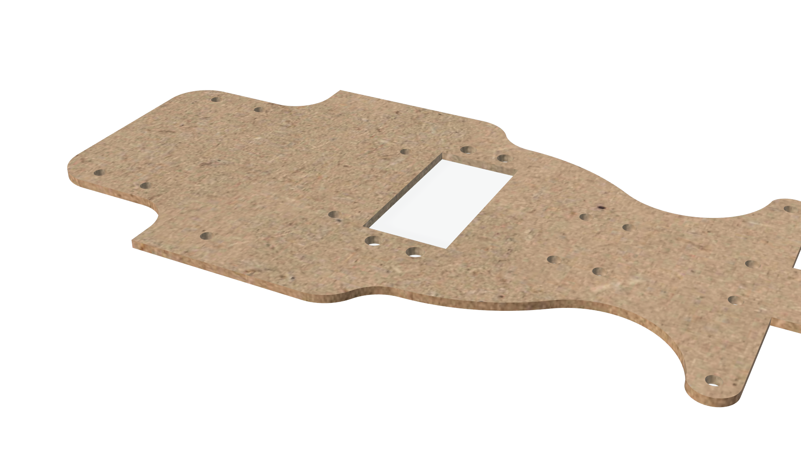
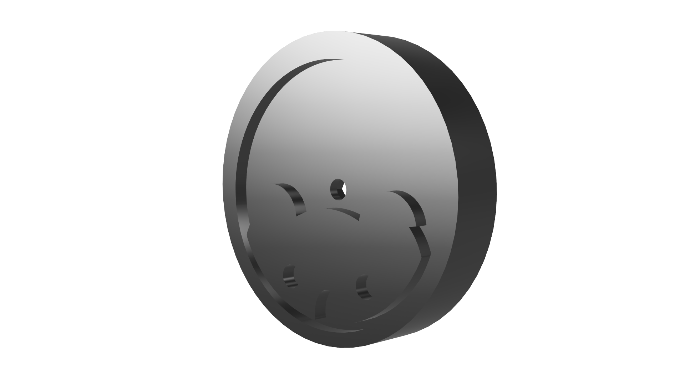
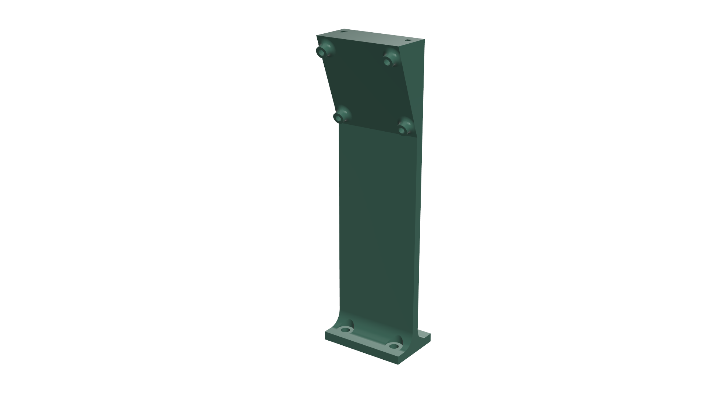
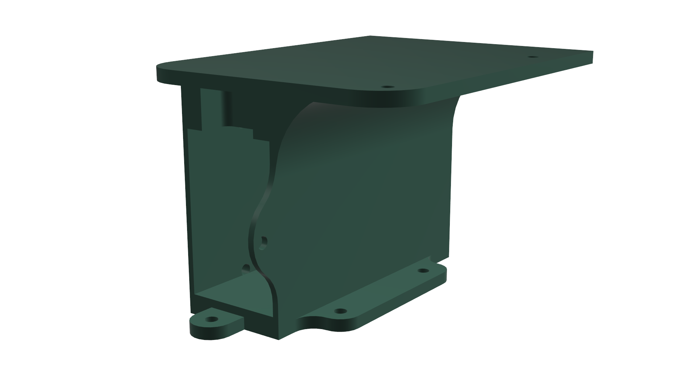

# Ruwance - WRO 2025

  

+ Team Name: **Ruwance**
+ Car Name: **Riska**
+ Club Name: **Robotek**
+ Team Members: **Isabella Gonzales & Vania Pachas**
+ Coach: **Anthony Valladolid**

---

*Welcome! 🎉*  
We are Team Ruwance, proudly representing Perú at the 2025 World Robot Olympiad! This GitHub repository contains the documentation, code, and full development journey of our autonomous vehicle, designed and built to compete in the Future Engineers Challenge.

# Repository Structure
* `t-photos` team photos (official one and funny one)
* `v-photos` photos of our vehicle (from every side, from top and bottom)
* `video` demonstration video link of the robot in the challenges
* `schemes` Wiring diagram with pins and electronic components
* `src` code of the robotic vehicle system
* `models` 3D printed parts and other chassis pieces 
* `other` Extra documentation

# Table of Contents
1. [Meet the Team!](#1-meet-the-team)
   
3. [Vehicle Overview](#2-vehicle-overview)
   + [General Description of the Car](#general-description-of-the-car)
   + [Versions of the Car](#versions-of-the-car)
     
4. [System Setup](#3-system-setup)
   + [Operating Environment Overview](#operating-environment-overview)
   + [ROS](#ros)
   + [Ubuntu](#ubuntu)
   + [Raspberry Pi](#raspberry-pi)
     
5. [Mobility Management](#4-mobility-management)
   + [Steering System - Ackermann](#steering-system-ackermann)
   + [Motor and Drivetrain](#motor-and-drivetrain)
   + [3D Pieces](#3d-pieces)
   
6. [Power & Sense Management](#5-power--sense-management)
   + [Power Source](#power-source)
   + [Sensors Integration](#sensors-integration)
   + [BOM (Bill of Materials)](#bom-bill-of-materials)
   + [Wiring Diagram](#wiring-diagram)

7. [Obstacle Management](#6-obstacle-management)
   + [Autonomous Driving Logic](#autonomous-driving-logic)
   + [Open Challenge](#open-challenge)
   + [Obstacle Challenge](#obstacle-challenge)
     
8. [Assembly Instructions](#7-assembly-instructions)
9. [Performance Videos](#8-performance-videos)
   
 

# Main Content

## 1. Meet the Team!
<table>
  <tr>
    <td width="55%" valign="top">
      <strong>Vania Pachas</strong>  
       <i>Responsible for Mechanical Design & Technical documentation</i> 
        vaniaapachas@gmail.com 
        Lima, Perú  
      Hi!! I'm Vania, an 18-year-old Peruvian passionate about innovation and STEM education. This is my first time in the WRO, and I'm excited to learn and take on this new challenge! I also love dancing salsa, crocheting, watching romcoms, and I’m a Quantum Computing enthusiast :)  
   
  <td width="45%" align="center">
    
    </td>
  </tr>
  
</table>

<table>
  <tr>
    <td width="55%" valign="top">
      <strong>Isabella Gonzales</strong>  
       <i>Responsible for Electronics and Technical Designer documentation</i> 
        isabellamilagros842@gmail.com 
        Lima, Perú  
      Hello! My name is Isabella, I'm 16 years old, and I love robotics. I founded Robotek Perú, a club where students can learn robotics and join competitions, and this is my second time at the WRO. My favorite hobbies are singing with my choir, practicing taekwondo, and art.   
   
  <td width="45%" align="center">
    
    </td>
  </tr>
  
</table>

 

> [!NOTE]
> 🤔Why is our team named *Ruwance*?  
> The name *Ruwance* comes from combining the Quechua word "**ruway**" and the English word "**chance**". Ruway means "to create" or "to do", which really reflects who we are, a team that is always making, building, and experimenting. As students of Robotek from Lima, Peru, we have learned that creativity and resilience are important traits to succeed in and enjoy our robotics journey.

 

## 2. Vehicle Overview

  

### **<ins>General Description of the Car</ins>**
Our autonomous vehicle is built to take on both the Open and Obstacle Challenges at the Future Engineers competition. Running on Ubuntu with ROS, it can process information and make decisions in real time. The car uses an Ackermann steering system and a custom-built chassis to move smoothly through turns and straight paths. A LiDAR sensor helps it detect the field walls, while the camera identifies traffic signs and obstacles. With this setup, the car can adapt its route, count laps, and complete the course efficiently.
 

| Front | Left | Right |
| :--: | :--: | :--: | 
|  |  |   | 

| Back  | Top  | Bottom |
| :--: | :--: |:--: |  
|  |  |   | 
> [!NOTE]
> Visit our [`v-photos`](https://github.com/vania020/wro2025-robotek/tree/main/v-photos) folder for more detailed photos of the car 📸🚗

### **<ins>Versions of the Car</ins>**
Our vehicle has gone through **10 versions** (and since we are always improving, there are still more to come!). It all started with a cardboard prototype, then moved on to acrylic and metal chassis designs, and later, we made personalized adjustments to a HiWonder kit. Along the way, we also experimented with different wheel designs, repositioned components, tested sensors like LiDAR, and finally adopted a new operating environment with ROS and Ubuntu.
<table>  
  <tr>
    <th width="10%">Version</th>
    <th width="40%">Car Photo</th>
    <th width="50%">Description</th>
  </tr>
  
  <!-- Version 1 -->
  <tr>
    <td align="center"><i>Version N°1</i></td>
    <td align="center">
      
    </td>
    <td>
      We built a cardboard prototype to test and understand the Ackermann steering system and wheel movement. This served as a reference to learn about the placement of components and systems.  
      <a href="v-photos/vehicle-versions/README.md#version-1">➡️ See more photos 🚗</a>
    </td>
  </tr>

  <!-- Version 2 -->
  <tr>
    <td align="center"><i>Version N°2</i></td>
    <td align="center">
    </td>
    <td>
       We cut and incorporated an acrylic chassis and designed/3D-printed housing pieces for the camera, Ackermann system, and other components. The Ackermann used a stepper motor, and to perceive its surroundings, the car relied on infrared sensors and a webcam. 
        The main controllers were a Raspberry Pi 4 and an Arduino Nano, powered by a power bank and lithium batteries. The car’s movement was driven by a single motor.   
      <a href="v-photos/vehicle-versions/README.md#version-2">➡️ See more photos 🚗</a>  
    </td>
  </tr>

  <!-- Version 3 -->
  <tr>
    <td align="center"><i>Version N°3</i></td>
    <td align="center">
    </td>
    <td>
        We replaced the power bank with a smaller one, adjusted component placement into a two-level car system, and installed new wheels. Lithium batteries were replaced with higher-current ones, and the infrared sensors were moved to the front, so the vehicle could make more precise turns.  
      <a href="v-photos/vehicle-versions/README.md#version-3">➡️ See more photos 🚗</a>  
    </td>
  </tr>

  <!-- Version 4 -->
  <tr>
    <td align="center"><i>Version N°4</i></td>
    <td align="center">
    </td>
    <td>
      We upgraded the chassis to a modified HiWonder Kit and replaced the infrared sensors with a LiDAR for more accurate obstacle detection. The webcam was also switched to a monocular camera. The original car motor was replaced by two encoder motors, adapted with gears to drive a single wheel in compliance with competition guidelines.  

For the Ackermann steering, we replaced the stepper motor with a servomotor. On top of that, we moved away from the Arduino Nano and began implementing the ROS framework.  
<a href="v-photos/vehicle-versions/README.md#version-4">➡️ See more photos 🚗</a>  
    </td>
  </tr>

  <!-- Version 5 -->
  <tr>
    <td align="center"><i>Version N°5</i></td>
    <td align="center">
    </td>
    <td>
       Our main improvement was the chassis. We joined the two bases by drilling them together and carefully organized the components with the Raspberry Pi inside. The LiDAR was placed on top so nothing would block its view, and we also completed and installed the camera housing.  
      <a href="v-photos/vehicle-versions/README.md#version-5">➡️ See more photos 🚗</a>  
    </td>
  </tr>

  <!-- Version 6 -->
  <tr>
    <td align="center"><i>Version N°6</i></td>
    <td align="center">
    </td>
    <td>
        Wheels were changed to adjust the car’s height so the Lidar could detect walls within the 10 cm range (previously it was too high and failed). The housing material was upgraded from PLA to polycarbonate for greater resistance, and the Open Challenge (autonomous 3 rounds driving) was completed.  
      <a href="v-photos/vehicle-versions/README.md#version-6">➡️ See more photos 🚗</a>  
    </td>
  </tr>

  <!-- Version 7 -->
  <tr>
    <td align="center"><i>Version N°7</i></td>
    <td align="center">
    </td>
    <td>
        Using our HiWonder kit as the base, we designed and cut a completely new, smaller chassis with personalized mounting holes for all components, new housing pieces were created, and the two-motor system was replaced by a single motor in a gear system.  
    We also moved from a two-level structure to a single-level layout, placing all the components on the same surface to give the Raspberry Pi better airflow and easier access. The car successfully detected and avoided the first traffic signs.  
      <a href="v-photos/vehicle-versions/README.md#version-7">➡️ See more photos 🚗</a>  
    </td>
  </tr>

  <!-- Version 8 -->
  <tr>
    <td align="center"><i>Version N°8</i></td>
    <td align="center">
    </td>
    <td>
        <b>Car dimensions:</b> 15 x 23 cm   
      We 3D-printed new, slimmer front wheels because the original ones stuck out too much from the chassis. A custom housing was also printed for the batteries, and most importantly, the Ackermann steering servo was mounted vertically to save space and allow for a wider turning angle.  
During previous testing, we realized the LiDAR was struggling to properly detect the walls of the field, so we 3D-printed and implemented a small angled mount to give it a slight tilt.  
      <a href="v-photos/vehicle-versions/README.md#version-8">➡️ See more photos 🚗</a>  
    </td>
  </tr>

<!-- Version 9 -->
  <tr>
    <td align="center"><i>Version N°9</i></td>
    <td align="center">
    </td>
    <td>
        <b>Car dimensions:</b> 15 x 20 cm   
In this version, the components were arranged more efficiently to save space. We added a custom housing for the batteries, placed the Pi5 controller on top, and mounted the Raspberry above it, creating a layered system.  
A new chassis base was printed in MDF, and the Ackermann was moved slightly because, in the previous version, the rack was colliding with the servo. To improve traction, we added a groove to the wheels and printed small cylinders between them to prevent contact with the screws. With these adjustments, the robot managed to complete a lap in <b>20 seconds</b>.  
      <a href="v-photos/vehicle-versions/README.md#version-9">➡️ See more photos 🚗</a>  
    </td>
  </tr>
  
  
</table>

 

> [!NOTE]
> Visit our [`vehicle-versions`](v-photos/vehicle-versions/README.md) folder to see photos and videos of our car evolution 🔝

 

## 3. System Setup
### **<ins>Operating Environment Overview</ins>**
The operating environment of our robotic car is designed as a structure that connects hardware, software, and middleware into a single functional system, shown in the diagram below:

  

### **<ins>Robot Operating System (ROS)</ins>** 
ROS is a framework that connects a robot’s software and hardware, making sensors, motors, and programs work together so the robot can perform tasks smoothly. For this project, we use ROS 2 Jazzy, one of the latest versions of ROS 2. You can find the documentation here:  [ROS 2 Documentation: Jazzy](https://docs.ros.org/en/jazzy/index.html) 

Without ROS, everything would have to be written in one long, complicated program that’s hard to manage. We can now divide the system into smaller parts, or nodes, that each do one job, making the system easier to build, fix, and expand. 

  

> This is an official animation to better understand how nodes work. Each node does one clear job, like moving wheels or reading sensors, and they talk to each other using topics, services, actions, or parameters.
>  In practice, this is the process:
> 1. Sensors send data to ROS 2 by publishing it on topics.
> 2. Other nodes listen to that data, process it, and decide what the car should do.
> 3. Finally, a controller node sends commands, making the car move accordingly.

 

*<ins>Why we use ROS?</ins>* 

<table>
  <tr>
    <td><b>Sensor & Actuator Integration</b></td>
    <td>
      ROS connects all sensors and actuators in one system, ensuring seamless coordination. 
      This gives our autonomous car continuous information about its surroundings 
      and optimizes overall performance.
    </td>
  </tr>
  <tr>
    <td><b>Environmental Perception with LiDAR</b></td>
    <td>
      Most manufacturers of advanced sensors, such as LiDARs, provide an official package to use their hardware with ROS. In the case of the DTOF STL-19P, the manufacturer provides a package that automatically publishes the LiDAR data so it can be processed afterward. Support with Python ROS is fully compatible with Python, which allows for versatile and high-level code development. In addition, being open-source, it has a large community that provides support and assistance for robot development.
    </td>
  </tr>
  <tr>
    <td><b>Debugging & Simulation</b></td>
    <td>
      ROS includes tools to quickly debug the content published on topics. It also provides tools such as RViz, which allows real-time data visualization, and Gazebo, which enables running simulations.
    </td>
  </tr>
  <tr>
    <td><b>Efficient Simulation & Debugging</b></td>
    <td>
      Virtual environments like 
      <a href="https://gazebosim.org/home">Gazebo</a> let us fine-tune parameters before implementation. 
      Tools like 
      <a href="https://docs.ros.org/en/humble/Tutorials/Intermediate/RViz/RViz-User-Guide/RViz-User-Guide.html">RViz</a> 
      allow real-time visualization of sensor data and car status, making debugging much easier.
    </td>
  </tr>
</table>

 

### **<ins>Ubuntu</ins>** 
Ubuntu is a popular, free, open-source operating system based on Linux. It is known for being reliable, flexible, and widely used in both research and industry. In our project, we use Ubuntu 24.04 as the **foundation that runs on the Raspberry Pi**. 

Ubuntu manages the Raspberry Pi’s resources efficiently, ensuring it runs correctly. It provides drivers and compatibility for sensors and external hardware, making integration easier. Ubuntu also allows us to install and run ROS 2 Jazzy and gives us access to important libraries and tools that simplify tasks such as sensor communication and system development. 

We use Ubuntu because of its stability and compatibility with ROS 2 Jazzy. Since ROS 2 packages are officially distributed for Ubuntu, using this operating system guarantees that we can easily install and manage the software needed for our car.
  

### **<ins>Raspberry Pi</ins>** 
The Raspberry Pi is a small computer that works as the brain of our car. It is powerful enough to run Ubuntu, ROS 2, and our algorithms in real time. In our project, we use the Raspberry Pi 5, which you can find here: [Raspberry Pi 5](https://www.raspberrypi.com/products/raspberry-pi-5/) 

**👉 Set up and configuration** 

With the [Raspberry Pi Imager](https://www.raspberrypi.com/software/), we flash Ubuntu 24.04 into the microSD card of the Raspberry. After that, we configure the basics like Wi-Fi, SSH for remote access, and hostname. And finally, we install ROS 2 Jazzy by following these steps: [Installation Ubuntu (deb packages)](https://www.google.com/url?q=https://docs.ros.org/en/jazzy/Installation/Ubuntu-Install-Debs.html&sa=D&source=docs&ust=1756316032253380&usg=AOvVaw24eBtKhOAoYRVzp4xh2Rkh)

| Step 1 | Step 2 | Step 3 | Step 4 |
| :--: | :--: | :--: |  :--: |
|  |  |  |  |

 

## 4. Mobility Management  

### <ins>**Steering System – Ackermann**</ins>

  

Our autonomous car uses an Ackermann steering system, controlled by a **15 kg·cm digital servo**, which provides precise and stable control for navigation and turns.  

The Ackermann steering geometry is designed to reduce tire slip by ensuring that all wheels align as radii of circles that share a common center when the car is turning. This configuration keeps the rear wheels fixed and places the center of rotation along a line extended from the rear axle. To achieve this geometry, the inside front wheel turns at a greater angle than the outside front wheel, allowing smoother and more efficient cornering.

---

### **Our own modifications ⚒️**

In the first versions of the car, we implemented the Ackermann steering system using a custom mechanism. We designed and 3D printed a gear connected to a stepper motor, along with a rack, which is a stick with grooves that fit into the gear teeth. When the motor rotated the gear, the rack would move, which in turn rotated the wheels.  

  
  

One of the challenges we faced was the 3D printing process itself. Printing small details such as gear teeth was difficult and often imprecise, which caused problems in the initial prototypes. To solve this, we made the gear teeth larger, and while this worked mechanically, the final design ended up taking too much space inside the chassis.

For this reason, we decided to switch to the system we currently use, which is part of the **HiWonder kit**, adapted to fit in our chassis base. Instead of gears, it uses a system of linkages connected by screws and supported by bearings. These linkages move and transfer the motion to the wheels, achieving the Ackermann steering effect in a more compact way.

  

> [!WARNING]
> At first, the Ackermann of the HiWonder kit worked fine — the car could turn and even get through some obstacles. But after a lot of testing, we noticed that whenever the car turned left, the Ackermann didn’t rotate as much as it did when turning right. This made obstacle avoidance harder, especially in the field corners, so we knew we had to make adjustments.

We realized that the servo needed to be repositioned. First, it was placed horizontally under the Ackermann linkages. We brainstormed how to make it more efficient and changed the position of the servomotor, mounting it vertically with the accessory facing downward under the chassis. This way, the linkages could move freely with more angles, and we also freed up extra space for the other components. This new placement also allowed us to reduce the length of the chassis.  

<table>  
  <tr>
    <th width="30%">Initial position</th>
    <th width="30%">Idea</th>
    <th width="30%">Final Position</th>
  </tr>
  <tr>
    <td align="center">
      
    </td>
    <td align="center">
      
    </td>
    <td align="center">
      
    </td>
  </tr>
  <tr>
    <td align="center">Servo mounted horizontally (limited angles)</td>
    <td align="center">Servo repositioned vertically</td>
    <td align="center">Final placement with improved steering</td>
  </tr>
</table>

---

### <ins>**Motor and Drivetrain**</ins>

  

The drivetrain of our autonomous car is powered by a **25 mm metal gear DC motor**, chosen for its compact size and high torque. The motor is mounted on the chassis and directly connected to the rear axle through a system of gears, ensuring efficient transfer of power to the wheels.  

Our drivetrain includes a gear reduction system:  
- The small gear is mounted on the motor shaft.  
- This small gear drives a larger gear connected to the rear axle.  
- The result is a reduction ratio that increases torque at the wheels, providing more force for acceleration and stability, even if the motor speed itself remains constant.

  

During assembly, we noticed a gap between the metal chassis part and the axle supports. This caused instability in the drivetrain. To fix it, we designed custom 3D-printed cylindrical spacers that fill the gap and keep the axle firmly in place. This simple solution reduces vibrations, prevents misalignment, and ensures smoother transmission of power from the motor to the wheels.

  

---

### <ins>**3D Pieces**</ins>

This is the 3D model of our vehicle.  
Below, you will find a table with our 3D-printed parts and their descriptions.

  

<table align="center" width="100%" style="table-layout: fixed;">
  <thead>
    <tr>
      <th width="30%">Component</th>
      <th width="40%">Preview</th>
      <th width="30%">Folder</th>
    </tr>
  </thead>
  <tbody>
    <tr>
      <td align="center"><b>Vehicle Base</b></td>
      <td align="center">
        
      </td>
      <td align="center">
        <a href="models/vehicle_base/" target="_blank">View</a>
      </td>
    </tr>
    <tr>
      <td align="center"><b>Vehicle Wheels</b></td>
      <td align="center">
        
      </td>
      <td align="center">
        <a href="models/vehicle_wheels/" target="_blank">View</a>
      </td>
    </tr>
    <tr>
      <td align="center"><b>Camera Housing</b></td>
      <td align="center">
        
      </td>
      <td align="center">
        <a href="models/camara_housing/" target="_blank">View</a>
      </td>
    </tr>
    <tr>
      <td align="center"><b>LiDAR Housing</b></td>
      <td align="center">
        
      </td>
      <td align="center">
        <a href="models/lidar_housing/" target="_blank">View</a>
      </td>
    </tr>
    <tr>
      <td align="center"><b>Raspberry Housing</b></td>
      <td align="center">
        
      </td>
      <td align="center">
        <a href="models/raspberry_housing/" target="_blank">View</a>
      </td>
    </tr>
  </tbody>
</table>

## 5. Power & Sense Management 

### <ins>**Power Source**</ins>

  

Our autonomous car is powered by 7.4V Li-Po batteries (2000mAh, 20C). We chose Li-Po batteries because they provide a high energy density, meaning more power in a small and lightweight package. The battery provides two main energy lines: one for the electronics and another for the motor:  

1. **Electronics & Sensors**  
   The battery first connects to the **RRC Lite Controller**, which regulates the power down to a safe **5 V**.  
   From there, it distributes electricity to:  
   - **Raspberry Pi 5** → acts as the brain of the car, running ROS 2 and processing sensor data.  
   - **Digital servomotor** → controls the Ackermann steering system.  
   - **STL-19P TOF LiDAR & monocular camera** → provide vision and distance perception.  

2. **Drive Motor (via L298N Motor Driver)**  
   In parallel, the battery also powers the **L298N motor driver** directly with **7.4 V**.  
   This driver regulates how much current goes to the **25 mm metal DC motor**, which is responsible for moving the car forward.  

By splitting the power into two paths (one regulated for sensitive electronics and one direct for the motor), the system ensures stability. Motors usually demand sudden spikes of current, and separating their supply avoids crashes or interruptions in the Raspberry Pi and sensors.

### <ins>**Sensors Integration**</ins>
To perceive its environment and handle the Future Engineers challenges, the car uses a combination of:  

- **STL-19P TOF LiDAR**: provides 360° distance data.  
- **2DOF Monocular Camera**: detects colors and obstacles.  

Together, these sensors give the robot a better understanding of its environment by combining depth perception with visual input.

### <ins>**STL-19P TOF LiDAR**</ins>

  

 

Unlike simpler sensors such as ultrasonic or infrared, which measure only in a single direction and have limited precision, the LiDAR sensor is capable of a **360° scanning** and provides precise distance measurements by using laser pulses. It helps the robot map its surroundings over a wide range, detect obstacles, and navigate more accurately in dynamic environments.

 

| Characteristic        | Vaue                        |
|------------------------|------------------------------|
| Ranging distance       | 0.03 – 12 m                 |
| Size                   | 38.59 x 38.59 x 34.8 mm     |
| Scanning Angle         | 360°                        |
| Scanning Frequency     | 5 – 13 Hz                   |
| Ranging Accuracy       | ±45 mm                      |
| Ranging Frequency      | 5000 Hz                     |

> [!IMPORTANT]
> **📍Placement:**
> The LiDAR was positioned at an altitude of under 10 cm, so it can detect the walls of the path, which are also 10 cm high. This placement ensures the Lidar has a clear view of the obstacles while remaining unobstructed by other components. All other elements on the car were arranged to avoid blocking the Lidar’s line of sight.   
> 

  
### <ins>**2DOF Monocular Camera**</ins>

  
  

 

The 2DOF Monocular Camera complements the LiDAR by adding visual perception. This allows the robot to recognize its environment beyond distance data, enabling future applications such as detecting the obstacles’ colors:

 + **Color detection**: Since graphical color detection is a core part of our  project, the camera can precisely identify various colors on the course. This allows our car to interact with the different traffic signs in the Obstacle challenge.
  + **Spatial awareness through data fusion**: When combining camera data with our sensor, the robot gains a richer understanding of its environment. The camera provides detailed visual context that leads to an adaptable navigation strategy.

> [!IMPORTANT]
> **📍Placement:**
> The camera is located in a special 3D mounting piece with a certain  inclination angle that points to the floor so it can better detect obstacles. At first it was placed at the front of the car but this location provided a limited vision and sticked out of the chassis lenght. See more detailed info of the housing piece in the [`3D Printed Parts`](#3d-printed-parts) section.    
> 

### **<ins>BOM (Bill of Materials)</ins>**
| Component | Quantity | Description | Image |
|-----------|----------|-------------|-------|
| Raspberry Pi 5 | 1 | Main processing unit for running **ROS**. Acts as the main brain and the Host Controller of the system, capable of running operating systems and handling complex processing tasks. |  |
| RRC Lite Controller | 1 | Integrates: ROS expansion board, High-Frequency PID Control, Motor Closed-Loop Control, Servo Control and Feedback, IMU Data Acquisition, Power Status Monitoring, and a Power Switch. |  |
| STL-19P TOF Lidar | 1 | Provides precise, 360-degree distance measurements for real-time navigation and obstacle detection in dynamic environments. |  |
| Lidar Adapter Board | 1 | Converts the LiDAR’s UART signals to USB for PC connection and data reading. |  |
| 15 kg.cm Digital Servo | 1 | Provides accurate steering control. |  |
| 65 mm Anti-Slip Rubber Wheel | 2 | High-grip wheels to improve traction and stability. |  |
| 25MM Metal Gear Motor | 1 | Core drive motor for powering the wheels with torque and speed. |  |
| Rubber Tire Edge | 2 | Ensures 3d- printed wheels stability and grip on the floor. |  |
| Monocular Camera | 1 | A camera used for capturing images and videos, can be used for computer vision or live streaming. |  |
| L298N Motor Driver | 1 | Controls motor direction and speed from the Raspberry Pi. |  |
| Jumper Cables | 4–8 | Electrical connections between the motor driver and Pi. |  |
| USB-USB Cable | 1 | A cable to connect the Raspberry Pi to the camera, Lidar, and Controller. |  |
| Li-Po Battery 7.4 V 5000mAh 20C | 1 | A lithium polymer battery that provides portable, high-density power. |  |

### <ins>**Wiring Diagram**<ins>

The following visual wiring diagram illustrates the **physical connections** between the modules (Raspberry Pi, LiDAR, camera, motor, etc.) using **realistic component images**. It helps visualize the system layout and understand **how components are arranged and linked** in the robot.  

  

#### **1. Raspberry Pi 5 Connections**
The Raspberry Pi 5 works as the brain of the car. Its USB ports connect the main sensors and the controller:

+ Camera → provides visual input for detecting traffic signs and colored obstacles.
+ LiDAR → provides distance and wall detection for navigation.
+ RRC Lite Controller → interfaces with the digital servomotor and forwards control signals to the motor driver.

  

#### **2. RRC Lite Controller**
The RRC Lite Controller acts as a bridge between the Raspberry Pi and the actuators. It regulates incoming power from the Li-Po battery (down to a safe 5 V) and distributes it to:  
- The **Raspberry Pi 5**  
- The **digital servomotor** for Ackermann steering  

It also handles communication with the motor driver to send PWM control signals.

---

#### **3. Motor Driver and DC Motor**
The **L298N Motor Driver** is powered directly by the **7.4 V Li-Po battery**.  
- It regulates both the **speed** and **direction** of the **25 mm metal gear DC motor**.  
- The motor then powers the rear axle through a gear reduction system, increasing torque for smoother acceleration.  

---

#### **4. Power Source**
The **7.4 V Li-Po battery** supplies energy to the entire system, split into two paths:  
- **Direct line (7.4 V):** powers the L298N motor driver and DC motor.  
- **Regulated line (via RRC Lite Controller):** delivers 5 V to the Raspberry Pi, servomotor, and sensors.  

 

This is also a diagram that shows the **electrical wiring** and pin-level connections between all components — including power lines, GPIOs, and communication ports. It focuses on **signal paths and voltage levels** rather than physical appearance.  

  

> [!NOTE]
> Visit our [`schemes`](https://github.com/vania020/wro2025-robotek/tree/main/schemes) folder to access all of our diagrams and schemes 🔑🚗

## 6. Obstacle Management 

### <ins>**Control Node Structure**</ins>

Since we use ROS 2 as the middleware that connects all the components of our autonomous vehicle, there is no single “main” code that runs either the Open Challenge or the Obstacle Challenge. Instead, the system is built as a collection of independent but interconnected ROS 2 nodes, each performing a specific function such as reading the camera, processing LiDAR data, or controlling the motors. These nodes communicate constantly through topics and messages, allowing the car to behave as a cohesive, intelligent system.

You can access our node codes here:
 

| Node | Code Description | Function |
|------|------|-----------|
| 🛰️ Acker LiDAR Node | [`acker_lidar_node`](./src/acker_lidar_node) | Reads and processes LiDAR scans. |
| 🎥 Camera Node | [`camara`](./src/camara) | Detects obstacles and colors. |
| ⚙️ Motor Node | [`motor`](./src/motor) | Sends PWM signals to control wheel speed. |

  

This table better explains our ROS topics and messages:

| **Node**                                | **Role**           | **Topic**                      | **Message Type**                                                   | **What It Transmits**                                                                                                                       |
| --------------------------------------- | ------------------ | ------------------------------ | ------------------------------------------------------------------ | ------------------------------------------------------------------------------------------------------------------------------------------- |
| **LiDAR Node**                          | Publisher          | `/scan`                        | `sensor_msgs/LaserScan`                                            | It sends 360° distance readings from the LiDAR; each value represents how far an obstacle is at a given angle.                                 |
| **Camera Node**                         | Publisher          | `/obstaculos`                  | `std_msgs/String`                                                  | It publishes the detected obstacle color in a text form: (`rojo`, `verde`, or `ninguno`), which defines how the main controller adjusts the steering setpoint. |
| **AckerLidar Node** *(Main Controller)* | Central Controller | `/motor_vel`, `/positionServo` | `std_msgs/Float32`, `ros_robot_controller_msgs/SetAckerServoState` | `/motor_vel`: Motor duty cycle (speed %). `/positionServo`: Steering position (PWM in µs) for Ackermann control.                            |
| **Motor Node**                          | Subscriber         | `/motor_vel`                   | `std_msgs/Float32`                                                 | Receives motor velocity commands from the main controller and translates them into PWM signals for the DC motor driver (L298N).             |
| **Raspberry Pi 5 Controller Node**      | Subscriber         | `/positionServo`               | `ros_robot_controller_msgs/SetAckerServoState`                     | Executes servo position commands and moves the front wheels to reach the target angle.                                                      |
| **RRC Controller Button**               | Publisher          | `/button`                      | `ros_robot_controller_msgs/ButtonState`                            | Sends an activation signal when the onboard button is pressed, starting the robot’s control loop.                                           |

### **What is a Message type?**

A **message type** is like a template that defines **what kind of data** is sent through a *topic*. For example, ROS already includes many built-in types, such as:

* `std_msgs/String` → used to send text.
* `std_msgs/Float32` → used to send a decimal number.
* `sensor_msgs/LaserScan` → used to send LiDAR data (distance readings around 360°).
* `geometry_msgs/Twist` → used to send linear and angular velocities (very common in mobile robots).
* And you can also have **custom message types**, like the ones included in your own package `ros_robot_controller_msgs`.

### **Important clarifiactions**

* For simplicity, **some topic names were shortened** in the diagrams.

  * The real ROS topic `/ros_robot_controller/acker_servo/set_state` is represented as **`/positionServo`**.
  * The real ROS topic `/ros_robot_controller/button` is represented as **`/button`**.

* The button input `/ros_robot_controller/button` is processed internally by the main node and does not appear as a separate node because it doesn’t exchange messages with others.

* The naming convention was simplified only for documentation clarity; all logic and connections in the code remain unchanged.

* The **AckerLidar Node** acts as the core controller that links everything:
  it subscribes to LiDAR and camera data, processes the PID control, and publishes both the steering and velocity commands.

> [!NOTE]
> If you would like to see a detailed description and explanation of the code behind each node, please visit our [`src`](https://github.com/vania020/wro2025-robotek/tree/main/src) folder 🖥️🚗
> 

---

### <ins>**Open Challenge**</ins>

The **Open Challenge** is the first autonomous driving test. In this stage, the robot must complete three laps **without any external input** relying only on its onboard **LiDAR sensor**, **PID controller**, and **Ackermann steering system**. The goal is to keep the car centered between the inner and external walls of the challenge during the entire lap. To achieve that, the robot constantly measures two key distances: **D₁** → Distance from the car to the **left wall** and **D₂** → Distance from the car to the **right wall**

The **control goal** is defined by the equation:

> **D₁ - D₂ = 0**  
> *(Setpoint = 0 → car is centered)*

When this balance holds true, it means that both walls are equidistant, and the car is aligned in the center of the track.

  

### **How It Works: LiDAR + Control Loop**

The LiDAR sensor scans the surrounding environment in real time, detecting obstacles and measuring the distances around the car. From these scans, two zones are analyzed, one on the **left** and one on the **right** to extract D₁ and D₂.

These values are sent to the **AckerLidarNode**, the main control node in charge of:
- Reading and processing LiDAR data  
- Computing the distance difference `error = D₁ - D₂`  
- Sending control signals to the **steering** and **motor** nodes

The logic is the following:  
1. If **D₁ > D₂**, the car is too close to the right wall → it turns slightly **left**.  
2. If **D₁ < D₂**, the car is too close to the left wall → it turns slightly **right**.  
3. If **D₁ = D₂**, the car is centered → it continues straight.

This process runs in a **PID feedback loop**, where:
- The **P (Proportional)** term corrects small deviations quickly.  
- The **I (Integral)** term reduces long-term bias (not always needed).  
- The **D (Derivative)** term prevents oscillations and overshoot.  

The result is a **smooth, stable trajectory** that keeps the car aligned throughout the race.

  

### **Open Challenge Flowchart**

  
 

#### Step-by-Step Description

1. **Start Robot & Initialization**  
   ROS2 nodes are launched: the LiDAR begins scanning, and the control node initializes all parameters (PID gains, setpoint, motor topics).

2. **Continuous Loop**  
   The system enters a continuous loop (`while rclpy.ok()`), running dozens of times per second. Each cycle updates sensor readings and steering actions.

3. **LiDAR Scan Environment**  
   The sensor performs a 360° scan to detect the walls and extract points on both sides of the track.

4. **Extract Wall Distances (D₁, D₂)**  
   The algorithm filters the LiDAR data to isolate the left and right regions, computes the average distance for each, and updates D₁ and D₂.

5. **Compute Error (D₁ - D₂)**  
   The difference between these distances represents how “off-center” the car is from the ideal middle of the lane.

6. **PID Steering Adjustment**  
   The PID controller processes this error and outputs an angle correction, which is sent to the **servo motor** using an Ackermann steering model.

7. **Update Lap Counter**  
   The control node counts laps based on internal flags or distance traveled (depending on the implementation in the ROS2 package).

8. **3 Laps Completed → Stop Vehicle**  
   After completing three full laps, the system safely reduces speed and stops the motor node.

### **Nodes and Communication**

During the Open Challenge, three ROS2 nodes work together in real time:

| Node | Role | Description |
|------|------|-------------|
| **`AckerLidarNode`** |Main Control Node | Subscribes to LiDAR data, calculates the distance difference, runs the PID controller, and sends steering/motor commands. |
| **`MotorPWMNode`** | Motor Control | Receives speed values (`Float32`) and controls the DC motor through PWM signals, ensuring smooth acceleration. |
| **`SetAckerServoState`** | Steering Control | Adjusts the steering servo angle according to PID output, maintaining Ackermann kinematics. |

---

### <ins>**Obstacle Challenge**</ins>

  

### **Obstacle Challenge Flowchart**

  

  
## 7. Assembly Instructions 

  
## 8. Performance Videos 

| Challenge | YouTube Video |
|------------|----------------|
| **Open Challenge** | [Watch on YouTube 🎥](https://www.youtube.com/watch?v=iRfN6pBE0Ac) |
| **Obstacle Challenge** | [Watch on YouTube 🎥](https://www.youtube.com/watch?v=5Ic2xejqBcA) |

