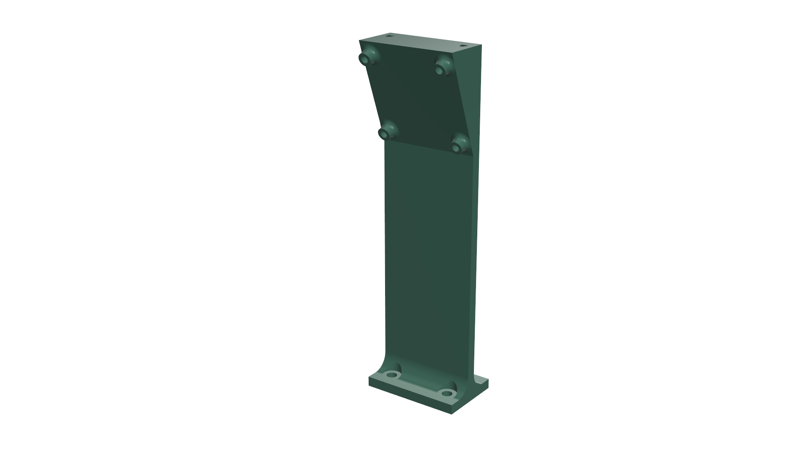

# Camera Housing
**Preview**

**Description:**  
This component holds the main camera. It ensures the correct viewing angle.
The mount features screw holes for M3 fasteners and is designed to fit the front section of the robot chassis.

**Model Details**
- Format: `.stl`
- Material: PLA
- Layer height: 0.16 mm
- Infill: 25%
- Supports: Required (base only)
