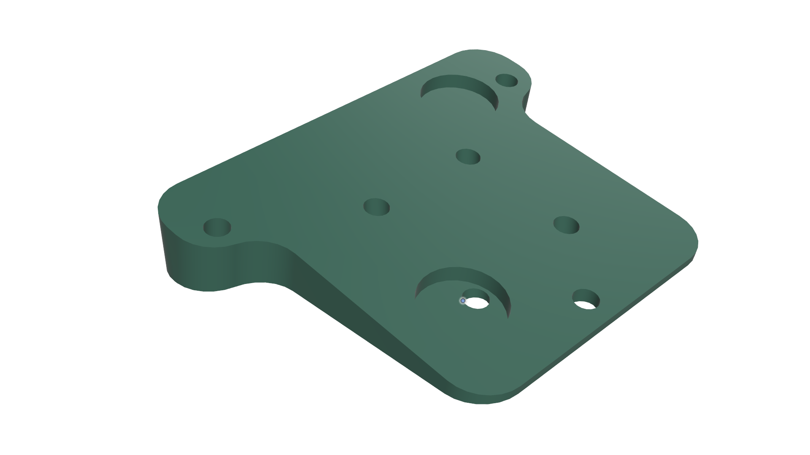

# LiDAR Housing

**Description:**  
This component serves as the mounting structure for the LiDAR sensor. It is slightly **inclined** to optimize the scanning angle and improve wall-distance measurements. The design includes **four screw holes** for secure attachment to the vehicle base and the LiDAR unit, ensuring mechanical stability during operation.

**Model Details**
- Format: `.stl`
- Material: PLA+
- Layer height: 0.20 mm
- Infill: 25%
- Supports: Yes, for internal cavities

