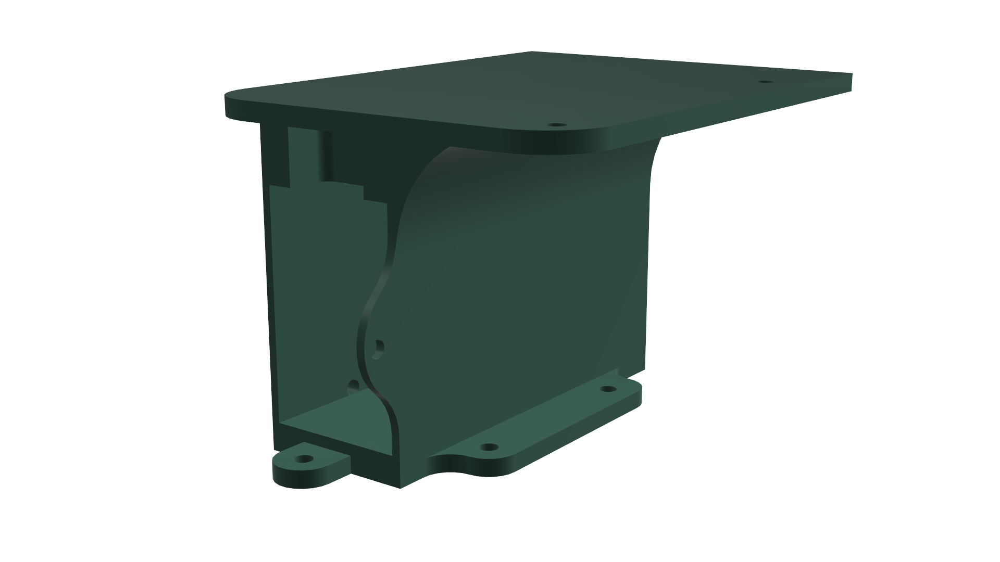

**Description:**  
This structure serves as a **space-efficient housing** that holds the **RRC Lite Controller** with the **Raspberry Pi 5**, our **7.4 V batteries**, and the L298N Motor Driver at the back. The design integrates components vertically to minimize the overall footprint of the robot.

**Design Highlights**
- Vertical design that saves horizontal space within the vehicle chassis.  
- Holds the Raspberry Pi and RRC Controller securely in stacked alignment.  
- Integrated compartment for battery placement underneath.
- Includes screw holes at the back for the motor driver. 

**Model Details**
- Format: `.stl`
- Material: PLA+ or PETG
- Layer height: 0.16 mm
- Infill: 20%
- Supports: Minimal (internal)
