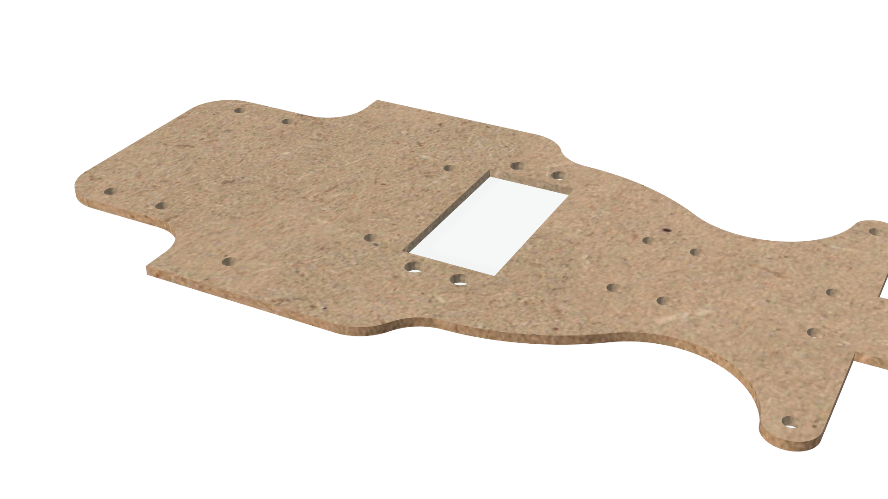

This piece is the **main platform of our vehicle**. It supports all the main componentslike the the Raspberry Pi, LiDAR, and camera housings. It was **laser-cut from MDF**, which gives it a good balance between strength and lightness. The design includes **placed holes** for screwing in the electronic and mechanical parts.

For the fabrication process, we started by sketching the base on squared paper and then prototyping it on cardboard. We used acrylic to test the dimensions on our first models. After confirming the fit, we finalized the design in Fusion 360 and cut it in MDF for the final version. 

  

> [!NOTE]
> This was our previous chassis design. It consisted of a base and upper casing that were crafted from aluminum. The base was designed to mount the Raspberry Pi and support the weight of the vehicle’s systems. The upper casing, which houses the LiDAR sensor, was designed to ensure the sensor has an unobstructed view. Still, having the components packed wasn't efficient for immediate modifications, which is why we changed it.
> 

**Model Details**
- Format: `.stl` (Fusion 360 export)
- Material: MDF
- Layer height: 0.2 mm (if 3D printed)
- Support: Not required

