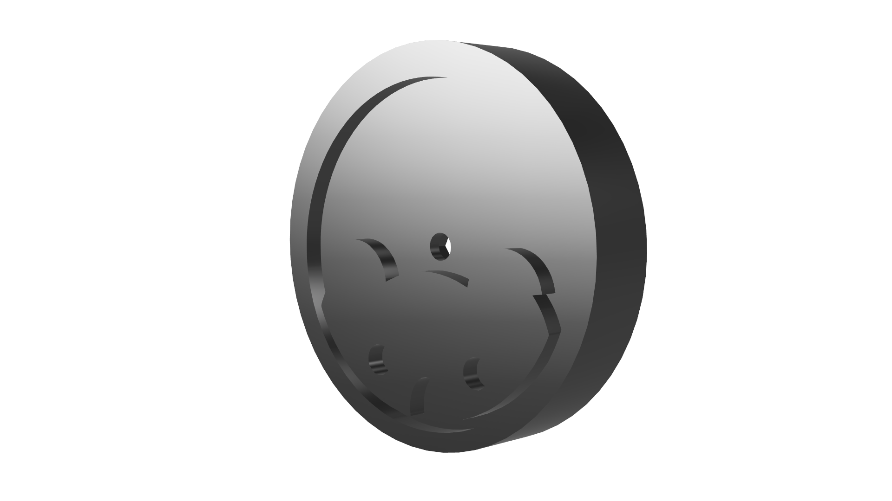

This is our front wheel design. Although we use standard Hi-Wonder Kit wheels at the back, we noticed that the front wheels were sticking out of the chassis too much, making the robot wider. To solve this, we decided to 3D print custom wheels with a 6 mm diameter.

Initially, we used them without any rubber or friction border, but the car couldn’t move properly. Later, we added a wheel border to increase traction, and everything worked perfectly. To give the robot a unique look, we also integrated the Robotek logo (the koala) into the wheel design.

**Model Details**
- Format: `.stl`
- Material: PLA
- Layer height: 0.20 mm
- Infill: 25%
- Supports: Yes, for internal cavities

